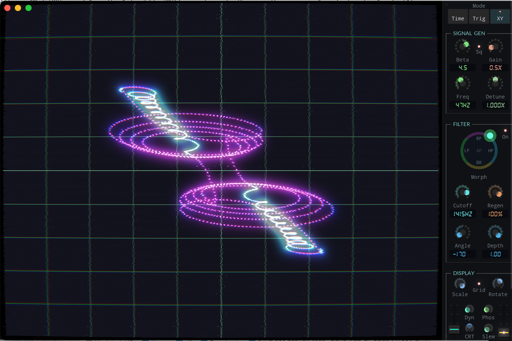

# Faveworm Oscilloscope

[](https://github.com/dfl/faveworm/actions/workflows/ci.yml)
[](https://github.com/dfl/faveworm/releases/latest)
[](https://github.com/dfl/faveworm/releases)

A love letter to the analog oscilloscopes of yore, transforming audio into liquid light. Inspired by the legendary work at [oscilloscopemusic.com](https://oscilloscopemusic.com).

## Demo Video
(click to watch on YouTube)
[](https://www.youtube.com/watch?v=yX30gl02Jhc)

## Installation

You can download the latest builds for macOS, Windows, and Linux from the [Releases page](https://github.com/dfl/faveworm/releases).

MacOS users: right-click and select "Open" to run the app the first time, in order to bypass "unidentified developer" warnings.

---

Built on the shoulders of giants with [Visage](https://github.com/VitalAudio/visage), Faveworm features a custom physics-based beam renderer raided from [Laurent de Soras' faveworm rendering plugin for Vapoursynth](https://ldesoras.fr/prod.html#src_vs).

<!-- 

## Display Modes

| Mode | Description |
|------|-------------|
| **TimeFree** | Classic horizontal sweep, free running. Good for checking levels. |
| **TimeTrigger** | Locked horizontal sweep. Stays steady on periodic signals. |
| **XY** | The main event. Left channel = X, Right channel = Y. Pure math aesthetics. |

## Controls

### General
| Key | Action | Note |
|-----|--------|------|
| `M` | Cycle Mode | Switch between the 3 modes above |
| `Space` | Play/Pause | Stop time (or just the audio) |
| `B` | Bloom | Toggle that sweet, hazy glow |
| `P` | Persistence | Toggle phosphor trail memory |
| `Up/Down` | Intensity | Crank the beam brightness |

### Trigger Mode
| Key | Action |
|-----|--------|
| `L` | Lock | Toggle autocorrelation locking (steady!) |
| `E` | Edge | Rising vs. Falling edge trigger |
| `Shift+Up/Down` | Threshold | Set the trigger point |

### Filter (XY Mode)
This is where the magic happens. We use a State Variable Filter to phase-shift the stereo signal, turning mono sources into rotating 3D-like structures.

| Key | Action |
|-----|--------|
| `F` | Filter Impulse | Toggle the SVF on/off |
| `S` | Split Mode | **Stereo Split**: Sends different filter responses (LP, HP, BP, etc.) to X and Y axes for phase wizardry. |
| `D` | Preset Cycle | Cycle through the curated Split Mode presets (see below) |
| `Left/Right` | Cutoff | Sweep the frequency spectrum |

### Split Mode Recipes
Different filter combinations create entirely different visual geometries. Here are some of our favorites:

| Preset | X Axis | Y Axis | Sweet Spot | Aesthetic |
|--------|--------|--------|------------|-----------|
| **Retro** | Lowpass | Highpass | 40-80 Hz | Classic ellipses, warm analog feel |
| **Flowers** | Bandpass | Allpass | 150-250 Hz | Swirling geometric petals |
| **Kaleidoscope** | Bandstop | Allpass | 300-800 Hz | Psychedelic mandalas, sharp edges |
| **Organic** | Lowpass | Bandpass | 100-200 Hz | Soft loops and folding shapes |
| **Liquid** | Allpass | Highpass | 20-40 Hz | Vector graphics, CRT water |
| **Complement** | Bandpass | Bandstop | 200-500 Hz | Complementary bands, "hollow" sounds | -->

### Test Signal Generator (XY Mode)

Beta controls the oscillator waveform, at high values you will get chaos!
Protect your ears by turning down the volume.

<!-- | Key | Action |
|-----|--------|
| `T` | Toggle Signal | Turn the internal noise machine on/off |
| `[` / `]` | Frequency | Tune the base pitch |
| `Shift+[` / `Shift+]` | Detune | Adjust the ratio between X and Y oscillators to control rotation speed |

## Filter Joystick
Check the bottom-right corner. This circular pad is your unified control surface for the SVF filter.

```
            BP (bandpass)
               ↑
               |
    LP ←———— AP ————→ HP
  (lowpass)  (center)  (highpass)
               |
               ↓
            BR (notch)
```

- **Angle**: Morphs between filter topologies (smooth crossfading!)
- **Radius**: Filter intensity (Center = bypass/allpass, Edge = max filter character)
- **Mouse Wheel**: Cutoff Frequency
- **Shift + Wheel**: Resonance (Q factor) - careful, it screams! -->

## Drag & Drop
If you drag a WAV file onto the window, it will load and loop.

## DIY build

```bash
cd build
cmake ..
cmake --build . --target Faveworm
```

## More Cool Stuff
See more of my audio projects at https://dfl.github.io/lowenlabs-audio/